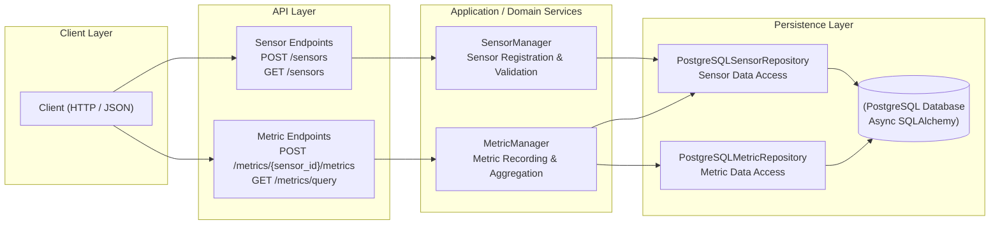

# Weather Sensor Metrics API

A REST API for collecting and querying weather sensor data with metrics like temperature, humidity, and wind speed.

## Task Description

The full task description can be found in [task_description.md](task_description.md).

## Development Environment Setup

### Prerequisites

1. **Poetry 1.8.1**: Install from [poetry.pypa.io](https://poetry.pypa.io/en/stable/installation/)
2. **Docker**: Install from [docker.com](https://docs.docker.com/get-docker/)
3. **Docker Compose**: Usually included with Docker Desktop

### Installation

```bash
# Install dependencies
make install-all
```

### Development Workflow

Before merging any changes, ensure all quality checks pass:

```bash
make format    # Format code with black and isort
make lint      # Check code quality with flake8, mypy, black, isort, and bandit
make test      # Run all tests
```

## Deployment

For demonstration purposes, the application uses Docker Compose with PostgreSQL.

### Deploy the System

```bash
# Start the application and database
make docker-up
```

### Destroy the System

```bash
# Stop and remove containers
make docker-down

# Stop and remove containers with volumes (clean slate)
make docker-clean
```

### View Logs

```bash
make docker-logs
```

## About the Task



The task description doesn't explicitly require sensor storage, but I implemented it to validate sensor IDs when saving metrics. This ensures data integrity and prevents orphaned metric records.

## API Endpoints

### Health

#### `GET /health`
Check the health status of the API and database connection.

**Response:**
```json
{
  "status": "ok",
  "database": "connected",
  "timestamp": "datetime"
}
```

### Sensors

#### `POST /sensors`
Register a new sensor in the system.

**Request Payload:**
```json
{
  "sensor_id": "string | null",     // Optional, 1-255 chars, will be generated if not provided
  "sensor_type": "string"           // Required, 1-100 chars, type of sensor
}
```

**Response:**
```json
{
  "sensor_id": "string",            // Generated or provided sensor ID
  "sensor_type": "string",          // Sensor type
  "created_at": "datetime"          // ISO 8601 timestamp
}
```

#### `GET /sensors`
Retrieve all registered sensors.

**Response:**
```json
[
  {
    "sensor_id": "string",
    "sensor_type": "string", 
    "created_at": "datetime"
  }
]
```

### Metrics

#### `POST /metrics/{sensor_id}/metrics`
Record a new metric value for a sensor.

**Path Parameters:**
- `sensor_id`: string (required) - Sensor ID to record metric for

**Request Payload:**
```json
{
  "timestamp": "datetime",          // Required, ISO 8601 timestamp
  "metric_type": "string",          // Required, enum: "temperature" | "humidity"
  "value": "number"                 // Required, float between -1000 and 1000
}
```

**Response:**
```json
{
  "sensor_id": "string",            // Sensor ID
  "status": "string",               // Status message: "data_recorded"
  "timestamp": "datetime"           // Timestamp of the recorded metric
}
```

#### `GET /metrics/query`
Query sensor metrics with aggregation.

**Query Parameters:**
- `sensor_ids`: `string[]` (optional) - List of sensor IDs, queries all if not provided
- `metrics`: `string[]` (required) - List of metric types: `["temperature", "humidity"]`
- `statistic`: `string` (required) - Statistic type: `"min" | "max" | "sum" | "avg"`
- `start_date`: `datetime` (optional) - Start date in ISO 8601 format
- `end_date`: `datetime` (optional) - End date in ISO 8601 format

**Example Request:**
```
GET /metrics/query?metrics=temperature&metrics=humidity&statistic=avg&start_date=2023-01-01T00:00:00Z&end_date=2023-01-07T23:59:59Z
```

**Response:**
```json
{
  "query": {
    "sensor_ids": ["string"] | null,
    "metrics": ["string"],
    "statistic": "string",
    "start_date": "datetime" | null,
    "end_date": "datetime" | null
  },
  "results": [
    {
      "sensor_id": "string",
      "metric": "string",
      "stat": {
        "statistic_type": "string",
        "value": "number"
      }
    }
  ]
}
```

## Database

I used PostgreSQL with SQLAlchemy for async support. Since this was my first time using these technologies, there might be errors and antipatterns in the database code.

### Tables

The database schema is defined in [`app/storage/database_models.py`](app/storage/database_models.py).

#### Sensors Table (`sensors`)
- `sensor_id` (String, Primary Key)
- `sensor_type` (String, Not Null)
- `created_at` (DateTime with Timezone, Not Null)

#### Metrics Table (`metrics`)
- `sensor_id` (String, Foreign Key to sensors.sensor_id)
- `metric_type` (Enum: temperature, humidity)
- `timestamp` (DateTime with Timezone)
- `value` (Float)

**Composite Primary Key:** `(sensor_id, metric_type, timestamp)`

**Indexes:** Multiple indexes for query optimization (see [`app/storage/database_models.py`](app/storage/database_models.py))

## Testing

The test suite includes unit and integration tests for demonstration purposes. Not everything is fully tested:

- **Unit Tests**: Service layer logic and repository operations
- **Integration Tests**: API endpoints and database interactions

Run tests with:
```bash
make test
```

Test structure mirrors the application structure:
- `tests/unit/services/` - Service layer tests
- `tests/unit/storage/` - Repository tests  
- `tests/integration/api/` - API endpoint tests
